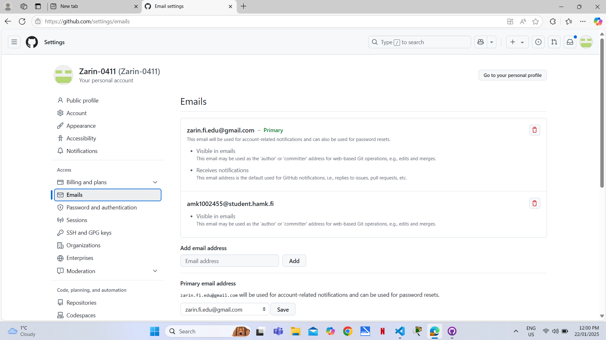

## Assingment 1

# Account Setup
- In  the first step, I'd created a Microsoft Azure account using email address that university had provoded me.

- Then I got  to know about the cloud and its' importance. 

- Additionally, I explored student benefits  and open an student account and Azure give me **$100** worth of credits that I can use to purchase any package within the environment.


# Create Virtual Machine
- I created virtual machine where I have to work later on this course.

- Then I select Marketplace from **Ubuntu Server 24.04 LTS gen 2 Server** published by Canonical. 

- I named my machine **"zap-robotics"**.

- I choose B series version 2 which is **Standard_B2ls_v2**.

- Later, I create a new resource group for the machine and subnet to place the machine in.

# Link my HAMK email to my GitHub account

- I create a new repository named **"linux"** for the assignment.

- Then I add my HAMK email as a secondary mail for version control.



## Assingment 3

This task is the process of creating users and managing permissions in a Linux environment. The tasks include creating different users, managing sudo privileges, and setting up a shared directory with specific permissions.

### Task 1: Creating User Tupu

The adduser script was used to create the Tupu user. This script provides an interactive way to create a new user with all necessary directories and settings.


The adduser script automatically:
- Creates the home directory
- Sets up default shell
- Prompts for password
- Creates user-specific group
- Sets up basic profile

### Task 2: Creating User Lupu

Initially, I tried using the following given command:

``` bash
sudo useradd -m -d /home/lupu -s /bin/bash -G lupu lupu
```

But, this resulted in an error.The issue was that we tried to add the user to a group that doesn't exist yet. To fix this, I modified the command to include the -U flag, which automatically creates a user group with the same name as the user.
After creation,I set the password.


### Task 3: Creating System User Hupu

Created a system user Hupu with restricted login capabilities.


It creates a system account that:

- Has no login shell (/bin/false)
- Is typically used for running services
- Has no home directory by default

### Task 4: Adding Sudo Privileges

Added sudo privileges for both Tupu and Lupu users using the usermod command.

Then I add:

``` bash
tupu ALL=(ALL:ALL) ALL
lupu ALL=(ALL:ALL) ALL
```


### Task 5: Setting Up Shared Directory

This task required creating a shared directory with specific permissions for Tupu and Lupu. Here's the steps:


The permission setup (2770) breaks down as:

- 2: SetGID bit (ensures new files inherit group ownership)
- 7: Owner has full permissions (read/write/execute)
- 7: Group has full permissions (read/write/execute)
- 0: Others have no permissions

This configuration ensures:

- Only Tupu and Lupu can access the directory
- New files automatically inherit the projekti group
- Other users cannot access the directory
- Both users have full control over the directory and its contents
